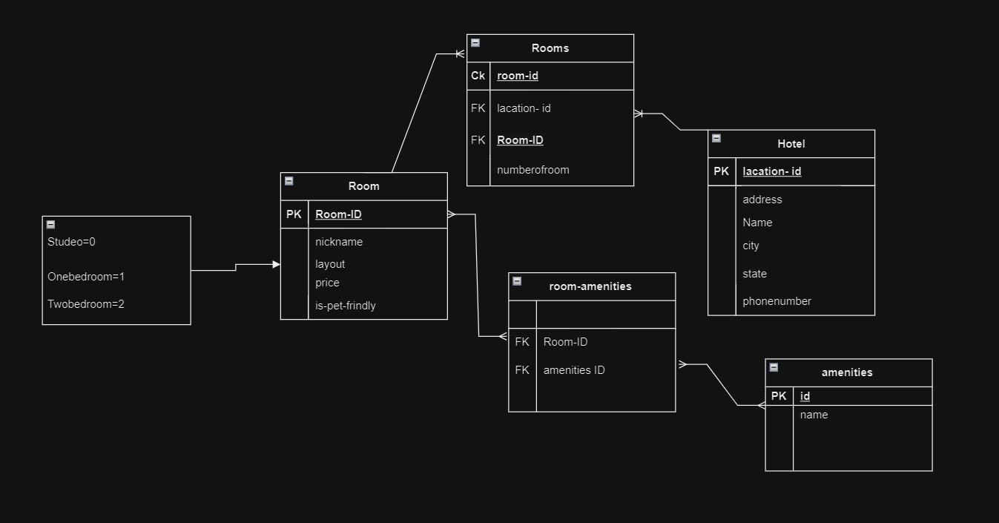

# Project Name: Async Inn Hotel Asset Management System

Author: Ammar Albesani

Date: 16/7/2023

Description :
The Async Inn Hotel Asset Management System is a web-based API designed to help Async Inn, a local hotel chain, better manage their hotel assets across multiple locations. This project aims to provide a RESTful API server that allows the management of rooms, amenities, and new hotel locations. The system leverages a relational database to store and maintain the integrity of the data.

# ERD Table

## Hotel table :
Hotel table has a location id which is a primary key which means it is only up for a hotel because we don't have two hotels with the same location id. and it also had a name,city, state. and each hotel has many rooms and it is connected with rooms table.

Room table :
The room table has a room id which is a primary key and it has payload attributes like a price, is pet-friendly, nickname, and layout Enum. and the room has a relationship with two tables it is one to many with Rooms because this room is one room in many rooms in the hotel and many to many with amenities because many rooms can have many of amenities and many amenities,  can be assigned for many rooms.

Amenities table:
Amenity table has a primary key  id and name attribute and the Amenity table has a relation with room and it is many to many.

 rooms table:
Hotel room is a Joint entity table between two tables and it is many to one with hotel and many to one with Room so in each Hotel we have an unique number of room number and it is composite key between the room id and hotel location id 

room-amenities table:
this is a pure join table with Composite-Foreign key the amenity id and the room id, so lets explain the data flow here, this each room can have multi amenity but cann't take duplicated amenity you can't find a room with two coffe maker for example, and many amenity can belong to single room.
